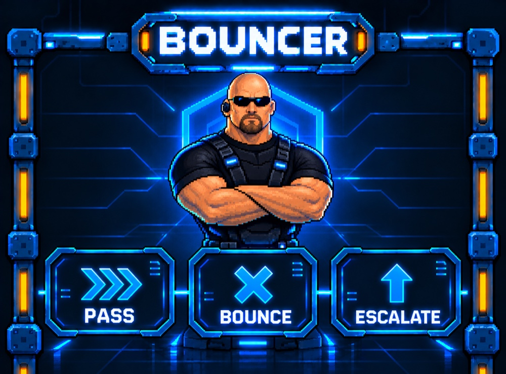

# Bouncer

<!-- markdownlint-disable MD033 -->
<p align="center">
  
</p>
<!-- markdownlint-enable MD033 -->

**A verification harness for agentic coding.**

[Léelo en castellano](README.es.md)

Your agent says it's done.

You look at the diff.

Something is wrong.

So you prompt it again:

> "The tests are failing. Fix them."

It fixes them.

Then it says it's done again.

You check.

Another thing is broken.

So you prompt it again.

This is the part of agentic coding that feels strangely manual: the agent can
do the work, but you are still the one deciding whether the work is actually
finished.

That shouldn't be your job.

The repository already knows how to check most of this:

- Linters know whether the syntax is valid.
- Tests know whether the code works.
- Terraform knows whether its configuration is valid.
- Helm knows whether a chart renders.
- kubeconform knows whether a manifest matches its Kubernetes schema.

The tools already exist.

What is missing is the thing that makes the agent listen to them.

That's Bouncer.

## The idea

Bouncer puts a verification gate between your agent and the end of its turn.

```text
You
 │
 ▼
Agent
 │
 │  "I'm done."
 ▼
Bouncer
 │
 ├── PASS ────────► You
 │
 ├── BOUNCE ──────► Agent
 │                   │
 │                   └── fixes the failure
 │
 └── ESCALATE ────► You
```

The agent still does the work. Bouncer doesn't replace the agent, improve its
reasoning, or rewrite its prompts.

It does one thing: it checks what the agent actually left behind.

If the repository passes its checks, the turn ends. If something fails, Bouncer
sends the failure back to the agent instead of ending the turn, and the agent
gets another chance to fix it.

You don't have to type the second prompt.

## Why this matters

An agent decides it is finished based on what it believes it accomplished.

Bouncer decides whether it is finished based on what actually happened.

Those are different things. An agent can say:

> "I've added the Kubernetes deployment."

And the repository can say:

> "The YAML doesn't parse."

Bouncer trusts the repository.

## What Bouncer checks

Bouncer doesn't invent a new verification language. It uses standard tools you
probably already know:

- linters
- validators
- tests
- schema checks
- security checks
- generated-file checks
- coverage thresholds

They are a fixed set, chosen for infrastructure work, and Bouncer runs only what
applies: no Terraform in your repository means no Terraform checks.

Tests are the part to look at before you rely on it. Bouncer runs pytest when it
finds `tests/` and `pyproject.toml` at the root of the repository, and no other
test runner. If your project tests with `go test`, `npm test` or `cargo test`,
add that command yourself: as a local hook in `.pre-commit-config.yaml`, which
the gate runs and whose failure blocks it, or as a stage in `scripts/verify.sh`
if the suite is slow, since pre-commit hooks also run on every `git commit`.

A local hook that runs a whole-project command needs two settings:
`pass_filenames: false`, or pre-commit appends every matching file name to the
command, and `always_run: true`, so it runs even when a commit touches no file
it matches. Under the `repo: local` hooks:

```yaml
      - id: project-tests
        name: project tests
        entry: go test ./...
        language: system
        pass_filenames: false
        always_run: true
```

An excerpt of what the agent gets back when a check fails. The hook hands it the
last sixty lines of the output, which also list the checks that passed or were
skipped:

```text
=== make verify FAILED (attempt 1/3): the turn cannot end ===
== units ==
  tfdocs helpers               ok
== static (pre-commit) ==
  pre-commit                   FAIL
      [...]
      yamllint.................................................................Failed
      - hook id: yamllint
      - exit code: 1

      config.yaml
        2:5       error    syntax error: mapping values are not allowed here (syntax)
      [...]

FAILED CHECKS:
  - pre-commit
```

That failure doesn't reach you as a new prompt. It goes back to the agent:

```text
Agent
  │
  ▼
Bouncer
  │
  │ FAIL
  ▼
"yamllint failed at config.yaml:2:5"
  │
  ▼
Agent
  │
  └── fixes config.yaml
```

Then the agent tries to finish again, Bouncer checks again, and that is the
bounce.

## The three possible outcomes

Every verification ends with one of three verdicts.

### PASS

The repository satisfies the gate. The turn ends.

```text
Agent → Bouncer → PASS → You
```

### BOUNCE

Something failed, but the agent gets another chance. The failure becomes part of
the agent's context, with no second prompt from you.

```text
Agent → Bouncer → FAIL
                   │
                   ▼
                 Agent
```

### ESCALATE

The agent has failed three times in a row. Bouncer stops the loop and gives the
decision back to you.

This matters because a verification loop without a limit is just another way to
burn tokens forever.

```text
attempt 1 → BOUNCE
attempt 2 → BOUNCE
attempt 3 → ESCALATE
```

One caveat: a turn can also end without the gate running at all, and it looks
just like a `PASS`. That happens when `.claude/.skip-verify` exists, when `jq`
or the `Makefile` is missing, or when the hook cannot read its input or reach
the project. [What was actually run](docs/evidence.md) covers each case.

## How it works

Bouncer uses two points in the agent's lifecycle. Both are Claude Code hooks:
commands Claude Code runs by itself, without you calling them.

- `PostToolUse` gives fast feedback while the agent is working: it lints each
  file right after it is edited or written.
- `Stop` is the final gate: it runs `make verify` when the agent tries to end
  the turn.

```text
                ┌────────────────┐
                │     Agent      │
                └────────┬───────┘
                         │
                  edits / writes
                         │
                         ▼
                ┌────────────────┐
                │  PostToolUse   │
                │   fast check   │
                └────────┬───────┘
                         │
                         ▼
                  Agent continues
                         │
                         │ "done"
                         ▼
                ┌────────────────┐
                │      Stop      │
                │  make verify   │
                └────────┬───────┘
                         │
           ┌─────────────┼─────────────┐
           ▼             ▼             ▼
         PASS         BOUNCE       ESCALATE
           │             │             │
           ▼             ▼             ▼
          You          Agent          You
```

The important detail is that Bouncer doesn't merely observe the failure. It can
prevent the turn from ending and hand the failure back to the agent. That is
what turns verification into a loop, and it comes down to the exit code a hook
returns: [how it works](docs/how-it-works.md#the-exit-code-is-the-whole-trick)
explains why.

## Try it

```bash
git clone https://github.com/Emi-Licha/bouncer.git
cd bouncer

make bootstrap
make demo
make selftest
```

`make bootstrap` installs the tools, which takes a few minutes the first time.
`make demo` shows Bouncer rejecting intentionally broken fixtures.
`make selftest` shows it accepting valid ones. You can see the gate working
before connecting it to an agent.

## Install it in your project

Bouncer is intentionally small. There is no new agent framework to learn and no
proprietary verification DSL. You copy the hooks and scripts into your
repository, restart Claude Code, and the gate becomes part of your agent's
workflow.

Run these from the root of your project.

**1. Check what you would overwrite.**

```bash
ls -d Makefile .pre-commit-config.yaml .yamllint.yml .markdownlint.yaml CLAUDE.md \
      .claude/settings.json .claude/hooks .claude/agents examples scripts 2>/dev/null
```

Anything listed already exists. Merge those by hand instead of copying over
them. If `scripts` shows up, check for files named like Bouncer's before step 2,
since those get overwritten.
[How it works](docs/how-it-works.md#merging-into-an-existing-project) says what
goes where.

**2. Copy the files.**

```bash
git clone https://github.com/Emi-Licha/bouncer.git /path/to/bouncer
mkdir -p .claude scripts
cp -R /path/to/bouncer/.claude/hooks /path/to/bouncer/.claude/agents .claude/
cp /path/to/bouncer/.claude/settings.json .claude/
cp /path/to/bouncer/scripts/*.sh scripts/
cp /path/to/bouncer/Makefile /path/to/bouncer/.pre-commit-config.yaml .
cp /path/to/bouncer/.yamllint.yml /path/to/bouncer/.markdownlint.yaml .
cp -R /path/to/bouncer/examples .
```

The last line is optional: it brings the fixtures `make demo` and
`make selftest` run against. Without them, both refuse to run rather than pass
having tested nothing.

**3. Keep Bouncer's scratch files out of git.**

```bash
printf '.claude/settings.local.json\n.claude/.skip-verify\n.verify-tmp/\n.bouncer-escalations.log\n' >> .gitignore
```

**4. Install the tools, and track the new files.** `pre-commit` only checks
files git knows about.

```bash
make bootstrap
git add .claude scripts examples Makefile .pre-commit-config.yaml \
        .yamllint.yml .markdownlint.yaml .gitignore
```

**5. Tell your agent the rules.** If you are creating `CLAUDE.md`, put a
top-level heading such as `# CLAUDE.md` on its first line: the Markdown linter
requires one, and without it the gate turns red as soon as you stage the file,
and git refuses the commit. Then add this:

```markdown
## Definition of Done

Before you start, lay out your plan in three lines and go ahead. It is not a
request for approval: it lets the user stop you if they disagree.

Nothing is done until `make verify` passes. If the Stop hook blocks the turn,
fix the cause. Never disable a check, lower a threshold, skip a test, or edit
the Makefile or the hooks to get past it.

Never use `git commit --no-verify`, and never create `.claude/.skip-verify`:
that file is the user's escape hatch.

After committing a milestone, review it with the `reviewer` subagent. Do not
push while it has a critical or high finding open.

When something fails twice, stop and ask instead of trying a third variation.
```

**6. Run the gate yourself once, before the agent does.** `make bootstrap` runs
only the static checks, silently, and none of the others, so anything your
repository already had wrong is still there, and it would bounce the agent's
very first turn.

```bash
make verify
```

Fix what it reports. If a rule does not fit your project, this is the moment to
adjust `.yamllint.yml`, `.markdownlint.yaml` or `.pre-commit-config.yaml`. That
is your decision while adopting Bouncer; once the hooks are live, `CLAUDE.md`
tells the agent never to relax a check to get past it.

**7. Restart Claude Code, then prove the gate is live.** Hooks are read when a
session starts, so nothing is armed until you restart. Then break something on
purpose and confirm you get stopped. A gate you have never seen block anything
is a gate you do not have, and [how it works](docs/how-it-works.md#the-trap)
gives you the three checks to run.

## What Bouncer is not

Bouncer is not an agent.

It doesn't write code.

It doesn't decide how to solve a task.

It doesn't make your model smarter.

It does something simpler: it makes your agent pass through the same
verification gate you would have used yourself.

The difference is that when something fails, the agent gets the failure first.
You come in when it passes, or when it escalates the problem to you.

## The commands

| Command | What it does |
| --- | --- |
| `make verify` | The gate. Everything else exists to run this at the right moment. |
| `make lint` | The fast static half on its own. |
| `make verify-full` | Adds a server-side dry run against a live cluster. |
| `make demo` | Proves the gate still catches things. |
| `make selftest` | Proves the gate still accepts good things. |
| `make escalations` | Every time the gate handed the decision to you, and why. |
| `make doctor` | Which tools you have, and which you are missing. |
| `make bootstrap` | Installs them. |
| `make lang` | Which language Bouncer is speaking. |
| `make clean` | Removes scratch and cache directories. |

## In your language

Bouncer speaks English by default, and so do the reviewer's reports. You can
have it in Spanish just for yourself by exporting the variable in the shell you
start Claude Code from, so the hooks see it too:

```bash
export BOUNCER_LANG=es
claude
```

Or for everyone who clones the repository, with a `.bouncer.conf` in the root:

```ini
lang = es
```

The variable wins over the file, and that way a team default and a personal
preference never have to fight.

## Read on

- **[How it works](docs/how-it-works.md)**: where Bouncer fits in an agent,
  what each file does, the two traps that make a gate look
  real while doing nothing, and why each decision went the way it did.
- **[What was actually run](docs/evidence.md)**: every claim here that was
  tested, how, and what was not tested. Including what Bouncer cannot do.

## Who it is for

- **You use Claude Code every day** and you are tired of the second prompt, the
  one that says "the lint is failing, fix it".
- **You write infrastructure with an agent.** Terraform, Kubernetes manifests,
  Helm charts, Kyverno policies: places where a plausible-looking mistake costs
  more than a failed build. That is the stack Bouncer checks out of the box.
- **Your team wants one Definition of Done** for work done with an agent, and
  the same gate to run for everyone.
- **You are building your own verification harness**, and want the exit-code
  semantics and the traps written down by someone who hit them.

It is probably not for you if:

- **Your agent is not Claude Code.** The loop depends on Claude Code hooks.
- **Your stack is JavaScript, Go, Java or Rust.** No linters are wired in for
  those languages yet.
- **You need it on Windows.** For now it is tested only on macOS.

## The idea in one sentence

**Don't ask the agent if it's done. Ask the repository.**

## License

MIT. See [LICENSE](LICENSE).
